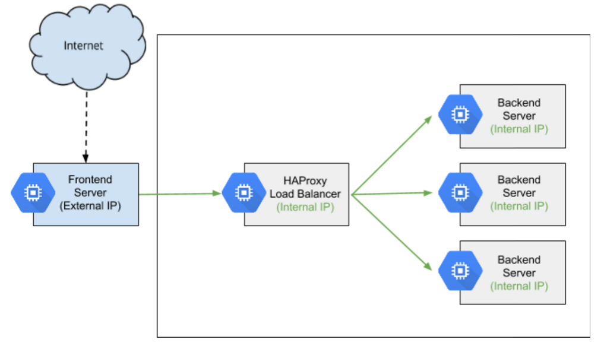
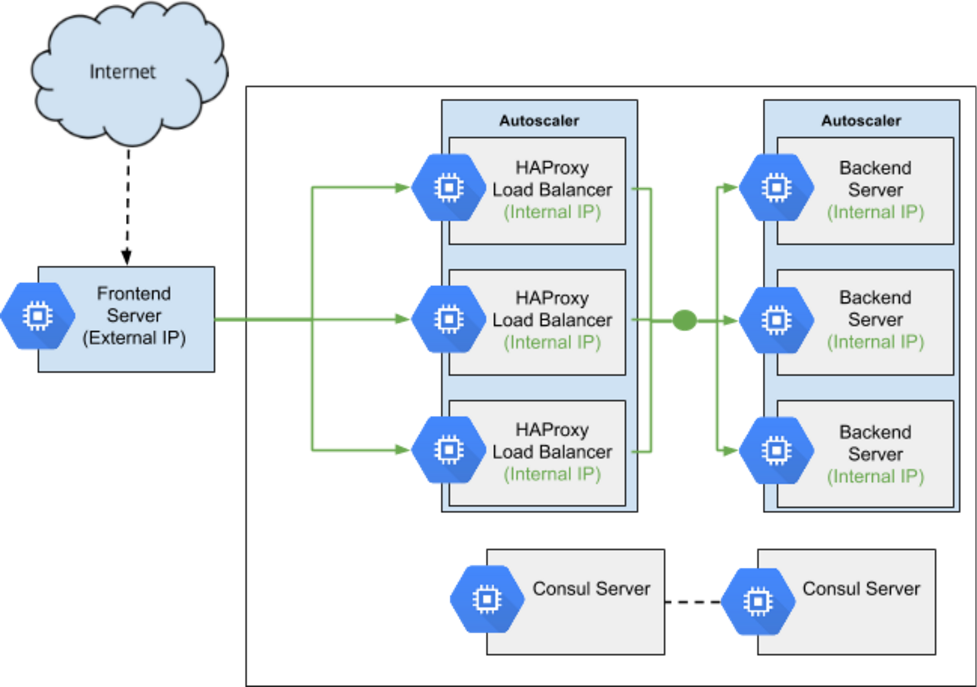

# Autoscaled Internal Load Balancing Using HAProxy and Consul on Google Compute Engine

An internal load balancer is used to distribute network traffic to servers on a private network. Neither the internal load balancer nor the servers it distributes traffic to are exposed to the public Internet. The [Internal Load Balancing using HAProxy on Google Compute Engine tutorial](https://cloud.google.com/solutions/internal-load-balancing-haproxy) provides a good explanation of the basics of internal load balancing, and walks you through configuring an internal load balancer using HAProxy and Google Compute Engine.



In this solution we extend the previous configuration to support autoscaling both the HAProxy load balancing tier and the backend server tier. This will allow servers to be gracefully added to or removed from their respective tiers, letting the infrastructure respond to changes in load  or recover from failure. [Consul](https://consul.io) will be used to provide the service discovery and distributed configuration mechanisms to enable this:



## The software stack
|   |   |
|---|---|
|Consul   |Consul is used for service discovery. Servers register with Consul and can be discovered by other servers in the cluster.|
|Consul Template   | Consul Template is used to monitor events in a Consul cluster and render a configuration template (and optionally restart a service) in response to changes in the cluster.|
|Dnsmasq   | Dnsmasq is used to forward DNS queries from an instance to Consul. It allows applications that rely on DNS to easily discover services in Consul.|
|HAProxy   | HAProxy is a high-performance TCP/HTTP load balancer.
|Backend server | A simple Go application that outputs a Google Compute Engine instance's local metadata as JSON.
|Frontend server | A simple Go application that consumes JSON from the backend server API and renders it as HTML.
|Packer   |Packer is a tool for creating pre-configured Google Compute Engine VM images. It will be used to install and configure Consul and HAProxy into a bootable image.    |
|Google Cloud Platform Managed Instance Groups and Autoscaler| A managed instance group is a pool of homogeneous instances, created from a common instance template. An autoscaler adds or remove instances from a managed instance group. |

## What you will learn
Each of the following sections discusses a specific aspect of the architecture diagram you just saw, and includes hands-on instructions for provisioning that section on Google Compute Engine. By the end of the document you will have learned about each section of the architecture in detail, and have it running and usable in your environment! At the end of the document, the entire solution is presented as a Deployment Manager template, allowing you to provision the entire exercise with just one API call.

### What you need
If you want to complete the tutorial as you read along, you’ll need just two things:
* A Google Cloud Platform account
* A new Google Cloud Platform project (create one at [https://console.developers.google.com/project)

## The Consul cluster
Consul is used for service discovery in this architecture. When the instances running HAProxy boot, they register with a Consul service named `haproxy-internal`, and the frontend server can discover all of the HAProxy servers with a DNS query to Consul. Similarly, instances running the backend application register with a Consul service named `api-internal` and can be discovered by the HAProxy servers.

To support service registration and discovery, you must run at least one Consul server. The makers of consul [strongly recommend](https://consul.io/docs/guides/bootstrapping.html) running 3-5 Consul servers per datacenter. Examples in this document will recommend running 3 Consul servers.

### Hands-on: Launch Consul servers
1. Create a [new Google Cloud Platform Project](https://console.developers.google.com/project)
1. Install `gcloud` on your workstation by following the instructions at [https://cloud.google.com/sdk/](https://cloud.google.com/sdk/)
1. Configure `gcloud` to use your new project:

  ```sh
  gcloud config set core/project YOUR_NEW_PROJECT_ID
  ```

1. Create a Google Compute Engine instance named `tool` that has `git` and `packer` pre-installed:

  ```sh
  gcloud compute instances create tool \
    --scopes=cloud-platform \
    --zone=us-central1-f \
    --metadata "startup-script=apt-get update -y && \
      apt-get install -y git unzip && \
      curl -o /tmp/packer.zip https://releases.hashicorp.com/packer/0.8.6/packer_0.8.6_linux_amd64.zip && \
      sudo unzip /tmp/packer.zip -d /usr/local/bin/" 
  ```

1. Connect to the new `tool` instance:

  ```sh
  gcloud compute ssh tool --zone=us-central1-f
  ```

1. Clone the source code repository to the `tool` instance:

  ```sh
  git clone https://github.com/evandbrown/compute-internal-loadbalancer.git
  ```

1. Set an environment variable containing your project ID:

  ```sh
  export PROJECT_ID=$(curl -H "metadata-flavor: Google" http://metadata.google.internal/computeMetadata/v1/project/project-id)
  ```

1. `cd` to the directory containing the Consul image files:

  ```sh
  cd compute-internal-loadbalancer/images/consul
  ```

1. Use `packer` to build the Google Compute Engine VM image for the Consul servers:

  ```sh
  packer build -var project_id=${PROJECT_ID} packer.json
  ```

1. Copy the ID of the image created:

  ```sh
  ==> Builds finished. The artifacts of successful builds are:
  --> googlecompute: A disk image was created: consul-1450847630
  ```

1. Launch 3 Consul servers, being sure you replace the `--image` flag with the image ID output in the previous step:

  ```sh
  gcloud compute instances create consul-1 consul-2 consul-3 \
    --metadata="^|^consul_servers=consul-1,consul-2,consul-3" \
    --zone=us-central1-f \
    --no-address \
    --image=YOUR_CONSUL_IMAGE_ID
  ```

1. After several minutes, SSH to one of the Consul servers and verify all 3 instances in the cluster have bootstrapped:

  ```sh
  $ gcloud compute ssh consul-1
  $ consul members
  Node      Address          Status  Type    Build  Protocol  DC
  consul-2  10.240.0.5:8301  alive   server  0.5.2  2         dc1
  consul-1  10.240.0.3:8301  alive   server  0.5.2  2         dc1
  consul-3  10.240.0.4:8301  alive   server  0.5.2  2         dc1
  ```
  
## The HAProxy load balancer
Lorem ipsum

### Hands-on: Launch HAProxy load balancers
  gcloud compute instances create haproxy \
    --metadata="^|^consul_servers=consul-1,consul-2,consul-3" \
    --zone=us-central1-f \
    --image=haproxy-1450926930

## The Backend aplication
Lorem ipsum

### Hands-on: Launch HAProxy load balancers
  gcloud compute instances create api-internal \
    --no-address \
    --metadata="^|^consul_servers=consul-1,consul-2,consul-3" \
    --zone=us-central1-f \
    --image=api-internal-1450940992


