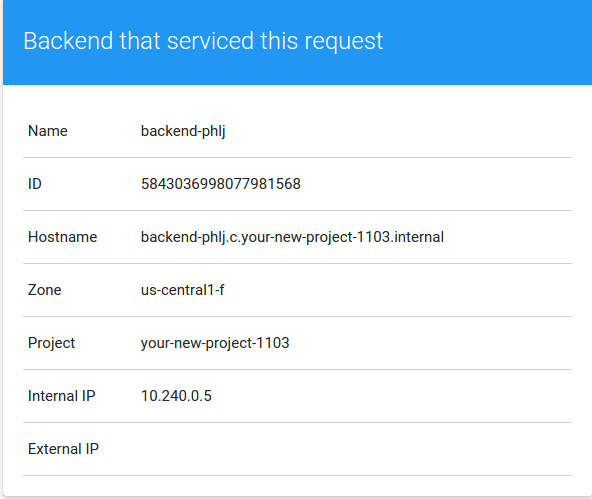

# Autoscaled Internal Load Balancing Using HAProxy and Consul on Google Compute Engine

An internal load balancer is used to distribute network traffic to servers on a private network. Neither the internal load balancer nor the servers it distributes traffic to are exposed to the public Internet. The [Internal Load Balancing using HAProxy on Google Compute Engine tutorial](https://cloud.google.com/solutions/internal-load-balancing-haproxy) provides a good explanation of the basics of internal load balancing, and walks you through configuring an internal load balancer using HAProxy and Google Compute Engine.


In this solution we extend the previous configuration to support autoscaling both the HAProxy load balancing tier and the backend server tier. This will allow servers to be gracefully added to or removed from their respective tiers, letting the infrastructure respond to changes in load  or recover from failure. [Consul](https://consul.io) will be used to provide the service discovery and distributed configuration mechanisms to enable this:


## The software stack
|   |   |
|---|---|
|Consul   |Consul is used for service discovery. Servers register with Consul and can be discovered by other servers in the cluster.|
|Consul Template   | Consul Template is used to monitor events in a Consul cluster and render a configuration template (and optionally restart a service) in response to changes in the cluster.|
|Dnsmasq   | Dnsmasq is used to forward DNS queries from an instance to Consul. It allows applications that rely on DNS to easily discover services in Consul.|
|HAProxy   | HAProxy is a high-performance TCP/HTTP load balancer.
|Backend server | A simple Go application that outputs a Google Compute Engine instance's local metadata as JSON.
|Frontend server | A simple Go application that consumes JSON from the backend server API and renders it as HTML.
|Packer   |Packer is a tool for creating pre-configured Google Compute Engine VM images. It will be used to install and configure Consul and HAProxy into a bootable image.    |
|Google Cloud Platform Managed Instance Groups and Autoscaler| A managed instance group is a pool of homogeneous instances, created from a common instance template. An autoscaler adds or remove instances from a managed instance group. |

## What you will learn
Each of the following sections discusses a specific aspect of the architecture diagram you just saw, and includes hands-on instructions for provisioning that section on Google Compute Engine. By the end of the document you will have learned about each section of the architecture in detail, and have it running and usable in your environment! At the end of the document, the entire solution is presented as a Deployment Manager template, allowing you to provision the entire exercise with just one API call.

### What you need
If you want to complete the tutorial as you read along, you’ll need just two things:
* A Google Cloud Platform account
* A new Google Cloud Platform project (create one at [https://console.developers.google.com/project)

## The Consul cluster
Consul is used for service discovery in this architecture. When the instances running HAProxy boot, they register with a Consul service named `haproxy-internal`, and the frontend server can discover all of the HAProxy servers with a DNS query to Consul. Similarly, instances running the backend application register with a Consul service named `api-internal` and can be discovered by the HAProxy servers.

To support service registration and discovery, you must run at least one Consul server. The makers of consul [strongly recommend](https://consul.io/docs/guides/bootstrapping.html) running 3-5 Consul servers per datacenter. Examples in this document will recommend running 3 Consul servers.

### Hands-on: Launch Consul servers
1. Create a [new Google Cloud Platform Project](https://console.developers.google.com/project)
1. Install `gcloud` on your workstation by following the instructions at [https://cloud.google.com/sdk/](https://cloud.google.com/sdk/)
1. Configure `gcloud` to use your new project:

  ```sh
  $ gcloud config set core/project YOUR_NEW_PROJECT_ID
  ```

1. Create a Google Compute Engine instance named `tool` that has `git` and `packer` pre-installed:

  ```sh
  $ gcloud compute instances create tool \
    --scopes=cloud-platform \
    --zone=us-central1-f \
    --image=debian-8 \
    --metadata "startup-script=apt-get update -y && \
      apt-get install -y git unzip && \
      curl -o /tmp/packer.zip https://releases.hashicorp.com/packer/0.8.6/packer_0.8.6_linux_amd64.zip && \
      curl -o /tmp/consul.zip https://releases.hashicorp.com/consul/0.6.0/consul_0.6.0_linux_amd64.zip && \
      sudo unzip /tmp/packer.zip -d /usr/local/bin/ && \
      sudo unzip /tmp/consul.zip -d /usr/local/bin/"
  ```

1. Connect to the new `tool` instance:

  ```sh
  $ gcloud compute ssh tool --zone=us-central1-f
  ```

1. Clone the source code repository to the `tool` instance:

  ```sh
  $ git clone https://github.com/GoogleCloudPlatform/compute-internal-loadbalancer.git
  ```

1. Set an environment variable containing your project ID:

  ```sh
  $ export PROJECT_ID=$(curl -H "metadata-flavor: Google" http://metadata.google.internal/computeMetadata/v1/project/project-id)
  ```

1. `cd` to the directory containing the Consul image files:

  ```sh
  $ cd ~/compute-internal-loadbalancer/images/consul
  ```

1. Use `packer` to build the Google Compute Engine VM image for the Consul servers:

  ```sh
  $ packer build -var project_id=${PROJECT_ID} packer.json
  ```

1. Copy the ID of the image created:

  ```sh
  ==> Builds finished. The artifacts of successful builds are:
  --> googlecompute: A disk image was created: consul-1450847630
  ```

1. Launch 3 Consul servers, being sure you replace the `--image` flag with the image ID output in the previous step:

  ```sh
  $ gcloud compute instances create consul-1 consul-2 consul-3 \
    --metadata="^|^consul_servers=consul-1,consul-2,consul-3" \
    --zone=us-central1-f \
    --no-address \
    --image=YOUR_CONSUL_IMAGE_ID
  ```

1. Join your `tool` instance to the cluster:

  ```sh
  $ consul agent \
    -data-dir=/tmp/consul \
    -retry-join=consul-1 \
    -retry-join=consul-2 \
    -retry-join=consul-3 &
  ```

1. View cluster members and verify that `consul-1`, `consul-2`, and `consul-3` are joined as type `server`:

  ```sh
  $ consul members
      2015/12/27 19:45:51 [INFO] agent.rpc: Accepted client: 127.0.0.1:60140
      Node          Address           Status  Type    Build  Protocol  DC
      consul-1      10.240.0.5:8301   alive   server  0.6.0  2         dc1
      consul-2      10.240.0.3:8301   alive   server  0.6.0  2         dc1
      consul-3      10.240.0.4:8301   alive   server  0.6.0  2         dc1
      tool          10.240.0.2:8301   alive   client  0.6.0  2         dc1
  ```

## The backend application
The backend application in this example is a simple microservice that returns the [instance metadata](https://cloud.google.com/compute/docs/metadata?hl=en) of the Google Compute Engine instance it is running. The instance metadata is returned as a JSON string in response to an HTTP Get request. Instances running the backend application have a private IP address but no public address. The source for the sample application is located [on GitHub](https://github.com/GoogleCloudPlatform/continuous-deployment-on-kubernetes/tree/master/sampleapp/gceme).

### Bootstrapping the backend
When a VM running the backend application comes online, it must join an existing Consul cluster, register itself as a service with the cluster, then start the application process to respond to HTTP requests. 2 systemd units - `consul_servers.service` and `backend.service` - are responsible for this bootstrapping.

1. `consul_servers.service`: this unit invokes the `consul_servers.sh` shell script, which retrieves the names of the Consul servers from the instance's metadata store and writes them to the file `/etc/consul-servers`. Consul servers must already be running, and the backend servers must be launched with a metadata attributed named `consul_servers` whose value is a comma-delimited list of Consul server names. Here is the unit file:

  ```
  [Unit]
  Description=consul_servers

  [Service]
  Type=oneshot
  ExecStart=/bin/sh -c "/usr/bin/consul_servers.sh > /etc/consul-servers"

  [Install]
  WantedBy=multi-user.target
  ```

2. `backend.service`: this unit runs after `consul_servers.service`. It reads Consul server names from `/etc/consul-servers`, then runs the `backend-start.sh` script. This script creates a Consul service file, then joins the cluster and registers the service, and finally starts the backend application. Here is the `backend.service` unit file:

  ```
  [Unit]
  Description=backend
  After=consul_servers.service
  Requires=consul_servers.service

  [Service]
  EnvironmentFile=/etc/consul-servers
  ExecStart=/usr/bin/backend-start.sh
  LimitNOFILE=9999999

  [Install]
  WantedBy=multi-user.target
  ```

  Here is the `backend-start.sh` script:

  ```sh
  #! /bin/bash
  export zone=$(curl -s -H "Metadata-Flavor: Google" "http://metadata.google.internal/computeMetadata/v1/instance/zone" | grep -o [[:alnum:]-]*$)

  # Set zone in Consul and HAProxy files
  envsubst < "/etc/consul.d/backend.json.tpl" > "/etc/consul.d/backend.json"

  # Start consul
  consul agent -data-dir /tmp/consul -config-dir /etc/consul.d $CONSUL_SERVERS &
            
  # Start the microservice
  /opt/www/gceme -port=8080
  ```

### The backend Consul service
Here is the `/etc/consul.d/backend.json` service file generated when the `backend.service` service is started:

```json
{
  "service": {
    "name": "backend", 
    "tags": ["us-central1-f"],
    "port": 8080
  }
}
```

When the Consul agent starts on a backend server, that server will be registered with the Consul cluster as a `backend` service with the availability zone it is running in as a tag. Members of the service can be discovered by resolving the DNS name `backend.service.consul.`. To find service members in a specific availability zone, prepend the tag to the name: `us-central1-f.backend.service.consul.`

### Hands-on: Launch the backend service
In this hands-on section, you will use Packer to build the VM image for the backend service, then use an [instance group](https://cloud.google.com/compute/docs/instance-groups/) to create and manage a cluster of backend servers:

1. On your tools instance, `cd` to the directory containing the backend image files:

  ```sh
  $ cd ~/compute-internal-loadbalancer/images/backend
  ```

1. Use `packer` to build the Google Compute Engine VM image for the Consul servers:

  ```sh
  $ packer build -var project_id=${PROJECT_ID} packer.json
  ```

1. Copy the ID of the image created:

  ```sh
  ==> Builds finished. The artifacts of successful builds are:
  --> googlecompute: A disk image was created: backend-1450847630
  ```

1. Create an [instance template](https://cloud.google.com/compute/docs/instance-templates) that describes the configuration of the backend servers, being sure to replace `YOUR_BACKEND_IMAGE_ID` with the output of the previous step:

  ```sh
  $ gcloud compute instance-templates create backend \
    --no-address \
    --metadata="^|^consul_servers=consul-1,consul-2,consul-3" \
    --image=YOUR_BACKEND_IMAGE_ID
  ```

1. Create an [instance group](https://cloud.google.com/compute/docs/instance-groups/) that will launch 2 backend servers using the backend template:

  ```sh
  $ gcloud compute instance-groups managed create backend \
    --base-instance-name=backend \
    --template=backend \
    --size=2 \
    --zone=us-central1-f
  ```


## The HAProxy load balancer tier
HAProxy is used to load balance requests to the backend servers. When a VM running HAProxy comes online, it must join an existing Consul cluster, register itself as a service with the cluster, discover the servers in the backend service, then start HAProxy. Like the backend servers, the HAProxy servers will only have private IP addresses and will not be accessible to the public Internet.

### The HAProxy Consul service
The service registered with Consul by each HAProxy server is named `haproxy-internal` and is defined as follows:

```json
{
  "service": {
    "name": "haproxy-internal",
    "tags": ["us-central1-f"],
    "port": 8080
  }
}
```

Like the earlier backend service, the `haproxy-internal` service is tagged with the availability zone the instances are running in. This will allow the frontend application to connect to any load balancer using the `haproxy-internal.service.consul` name, and will also allow zone-specific lookups by prepending a particular zone to the lookup name, for example `us-central1-f.haproxy-internal.service.consul` will only return service members in the `us-central1-f` availability zone.

### Discovering servers in the backend service with `consul-template`
To load balance requests the HAProxy servers need to know the IP address of all healthy backend servers. This solution uses `consul-template` to update HAProxy's configuration file (`/etc/haproxy/haproxy.cfg`) and reload the HAProxy service every time the membership of the backend service changes. This snippet of the `haproxy.cfg` template file shows the zone-specific `us-central1-f.backend` service being iterated and writing `server` directives that indicate available servers to HAProxy:

```
listen http-in
        bind *:8080{{range service "us-central1-f.backend"}}
        server {{.Node}} {{.Address}}:{{.Port}}{{end}}  
```

`consul-template` is executed by systemd (see the `consul_template.service` unit file for more detail) as follows:

`consul-template -template "/etc/haproxy/haproxy.ctmpl:/etc/haproxy/haproxy.cfg:service haproxy restart" -retry 30s -max-stale 5s -wait 5s`

### Hands-on: Launch HAProxy load balancers
In this hands-on section, you will use Packer to build the VM image for the HAProxy load balancer servers, then use an [instance group](https://cloud.google.com/compute/docs/instance-groups/) to create and manage a cluster of servers:

1. On your tools instance, `cd` to the directory containing the HAProxy image files:

  ```sh
  cd ~/compute-internal-loadbalancer/images/haproxy
  ```

1. Use `packer` to build the Google Compute Engine VM image:

  ```sh
  packer build -var project_id=${PROJECT_ID} packer.json
  ```

1. Copy the ID of the image created:

  ```sh
  ==> Builds finished. The artifacts of successful builds are:
  --> googlecompute: A disk image was created: haproxy-1450847630
  ```

1. Create an [instance template](https://cloud.google.com/compute/docs/instance-templates) that describes the configuration of the backend servers, being sure to replace `YOUR_HAPROXY_IMAGE_ID` with the output of the previous step:

  ```sh
  gcloud compute instance-templates create haproxy \
    --no-address \
    --metadata="^|^consul_servers=consul-1,consul-2,consul-3" \
    --image=YOUR_HAPROXY_IMAGE_ID
```

1. Create an [instance group](https://cloud.google.com/compute/docs/instance-groups/) that will launch 2 HAProxy servers:

  ```sh
  gcloud compute instance-groups managed create haproxy \
    --base-instance-name=haproxy \
    --template=haproxy \
    --size=2 \
    --zone=us-central1-f
  ```

## The Frontend aplication
The frontend application in this example consumes the JSON output from the backend (via the HAProxy load balancers) and renders it as HTML:


Instances running the frontend application have a public and private IP address. They can receive requests from the public Internet, and make requests to the HAProxy servers via private IP addresses. The source for the sample application is the same as the backend and is available [on GitHub](https://github.com/GoogleCloudPlatform/continuous-deployment-on-kubernetes/tree/master/sampleapp/gceme).

### Connecting the frontend to the backend
The frontend application accepts the location of the backend as a runtime flag:

```sh
gceme -frontend=true -backend-service=http://BACKEND_SERVICE_ADDRESS:PORT
```

The frontend servers are also members of the Consul cluster, so they can easily discover the HAProxy service via DNS and provide that service name as the value to the `backend-service` flag when the frontend process is started:

```sh
gceme -frontend=true -backend-service=http://us-central1-f.haproxy-internal.service.consul:8080
```

### Consul service discovery with DNS and Dnsmasq
[Dnsmasq](http://www.thekelleys.org.uk/dnsmasq/doc.html) is installed on the frontend servers and `/etc/resolv.conf` is modified to include `127.0.0.1` as a nameserver, allowing dnsmasq to resolve queries for the `.consul` TLD. `consul-template` is then used to render a second hosts file - `/etc/hosts.consul` - that contains the hostnames and addresses of load balancers in the HAProxy service. The `consul-template` file to generate `/etc/hosts.consul` is:

```
{{range service "$zone.haproxy-internal"}}
{{.Address}} $zone.{{.Name}} $zone.{{.Name}}.service.consul{{end}}
```

`consul-template` renders this file and restarts the dnsmasq service whenever HAProxy servers are added or removed from their instance group. A rendered `/etc/hosts.consul` looks like:

```
10.240.0.8 us-central1-f.haproxy-internal us-central1-f.haproxy-internal.service.consul
10.240.0.9 us-central1-f.haproxy-internal us-central1-f.haproxy-internal.service.consul 
```

Finally, dnsmasq is configured to use this additional hosts file and is able to answers resolution requests for `haproxy-internal.service.consul` from the frontend application. Complete details of the instance configuration are available in the `images/frontend` directory.

### Hands-on: Launch the frontend application
In this hands-on section, you will use Packer to build the VM image for the frontend servers, then launch a single frontend instance with a public IP address.

1. On your tools instance, `cd` to the directory containing the frontend image files:

  ```sh
  $ cd ~/compute-internal-loadbalancer/images/frontend
  ```

1. Use `packer` to build the Google Compute Engine VM image:

  ```sh
  $ packer build -var project_id=${PROJECT_ID} packer.json
  ```

1. Copy the ID of the image created:

  ```sh
  ==> Builds finished. The artifacts of successful builds are:
  --> googlecompute: A disk image was created: frontend-1450847630
  ```

1. Create a frontend instance with a public IP address and the `http-server` tag that will open port 80. Be sure to replace `YOUR_FRONTEND_IMAGE_ID` with the output of the previous step:

  ```shell
  $ gcloud compute instances create frontend \
    --metadata="^|^consul_servers=consul-1,consul-2,consul-3" \
    --zone=us-central1-f \
    --tags=http-server \
    --image=YOUR_FRONTEND_IMAGE_ID
  ```

1. The details of the instance will be output when the create operation succeeds, and will look similar to the following:

  ```shell
  NAME     ZONE          MACHINE_TYPE  PREEMPTIBLE INTERNAL_IP EXTERNAL_IP   STATUS
  frontend us-central1-f n1-standard-1             10.240.0.10 104.197.14.97 RUNNING
  ```

1. Copy the value for `EXTERNAL_IP` and open it in your browser to view the frontend application. You should see an interface similar to this:

  

1. Refresh the page several times and notice that different backends are serving the request.

## Simulate HAProxy and backend server failuresjkk


